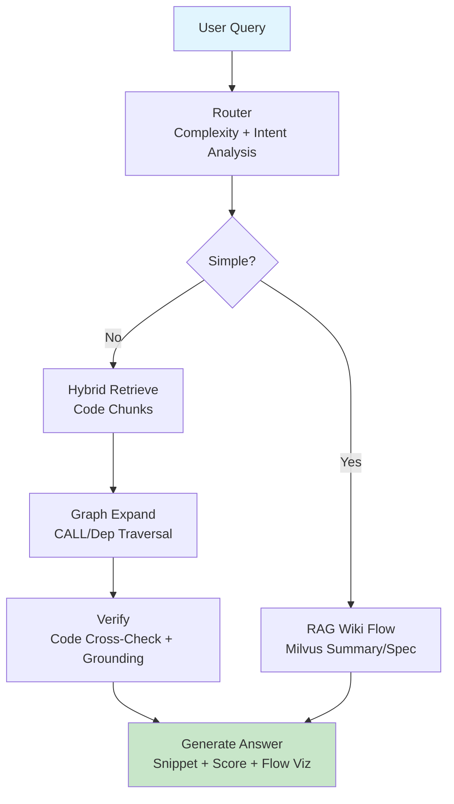

# ĐỀ ÁN CẢI THIỆN HỆ THỐNG QA CHO CODEBASE LEGACY

**Tác giả:** [Tên bạn]  
**Ngày:** 10/04/2026  
**Mục tiêu:** Nâng cao QA cho legacy Cobol/RPG với code grounding và graph tracing.

---

## 1. Bối Cảnh & Vấn Đề Hiện Tại

Hệ thống QA hiện tại sử dụng **RAG + Milvus** trên dữ liệu **summary/spec**, đạt hiệu quả tốt cho query tổng quan.[web:1]

### Các Hạn Chế Chính
- **Code-level QA yếu**: Không xử lý implementation details.  
- **Không truy vết flow**: Call chain, batch JCL, data flow.  
- **Legacy naming kém**: Semantic search fail với convention cũ.  
- **Hallucination cao**: Thiếu code grounding thực tế.[web:8]

---

## 2. Đề Xuất Chính

**Chuyển paradigm**: Từ document-centric sang **code & structure-centric QA**.

### Cải Tiến Core
- **Giữ Milvus**: Cho summary/spec (quick recall).  
- **Thêm code index**: Program, Procedure, Function.  
- **Hybrid retrieval**: Semantic + Keyword (BM25) + Exact match (alias).[web:8]  
- **Multi-step agent**: Router → Retrieve → Expand → Verify → Answer.[web:10]

**Lợi ích hybrid**: Precision cao, cost thấp, đa query type.[web:8]  
**Hại hybrid**: Multi-index management phức tạp.

---

## 3. Kiến Trúc Chi Tiết

### 3.1 Data Layer
```
- Parse: LLM (high-level) + Rule-based (syntax legacy)
- Index: 
  ├─ Program
  ├─ Procedure  
  └─ Function
- Metadata: CALL graph, Data deps
```

### 3.2 Router Layer
Phân loại **query complexity + intent**:
| Loại Query | Flow |
|------------|------|
| Đơn giản (wiki/search) | RAG Wiki |
| Phức tạp (code/reasoning) | Advanced Agent[web:10] |

### 3.3 Retrieval Layers

#### Hybrid Search
```
Semantic (Embedding)    → Context understanding
Keyword (BM25)          → Exact terms
Exact Match (Alias)     → Legacy naming fix
↓ Fusion → Top-K chunks
```
**Lợi ích**: Recall + Precision tối ưu.[web:14] **Hại**: Fusion logic cần tune.

#### Graph Expansion
- **Graph nodes**: Programs, Procedures, JCL Steps.  
- **Edges**: CALL, Data flow.  
- Truy vết: `JCL → Step → Program → CALL chain`.[web:6][web:13]

**Lợi ích graph RAG**: Relationship reasoning mạnh.[web:9]  
**Hại**: Graph build heavy cho large codebase.[web:15]

### 3.4 QA Agent Pipeline



**Lợi ích multi-agent**: Modular, scalable, low hallucination.[web:10]  
**Hại**: Latency cao hơn, orchestration phức tạp.

### 3.5 Output Format

✅ **Programs**: PROG001, PROG002
🔗 **Call Chain**: MAIN → PROC_A → FUNC_X
📊 **Data Flow**: INPUT_FILE → PROC_A → OUTPUT_DS  
💻 **Snippet**:
  ```cobol
  PERFORM PROC-A THRU PROC-A-EXIT
  ```
🎯 **Confidence**: 92% (grounded by 3 snippets)


---

## 4. Lợi Ích Triển Khai

### 4.1 QA Quality
- **Code accuracy** ↑, **end-to-end tracing** OK.  
- **Hallucination** ↓ qua verification.[web:13]  
- **Trust** ↑ với traceable sources.

### 4.2 Business Value
- **Debug/Ops** 2x faster.  
- **Onboarding** developer nhanh.  
- **Migration** legacy → modern hỗ trợ.

### 4.3 Future-Proof
- Impact analysis, auto-refactor, migration assistant.

---

## 5. So Sánh Hiện Tại vs Mới

| Tiêu Chí | Hiện Tại | Đề Xuất | Gain |
|----------|----------|---------|------|
| **Code QA** | Summary-based | Code-direct + snippet | +80% acc[web:1] |
| **Flow Trace** | None | Graph full-path | Complete |
| **Legacy Name** | Poor | Hybrid fix | +60% recall[web:8] |
| **Reliability** | Hallucinate | Grounded | High trust |
| **Complex Query** | Single-step | Multi-agent | Handles all |
| **Cost/Complexity** | Low | Medium-High | Worth ROI |

---

## 6. Roadmap Triển Khai

1. **Phase 1 (1-2w)**: Code parser + Milvus code index.  
2. **Phase 2 (2-3w)**: Hybrid + basic graph.  
3. **Phase 3 (3-4w)**: Agent + router integration.  
4. **Phase 4**: Production, monitor, tune.

**Tổng**: ~2-3 tháng POC → full.

---

## 7. Tham Khảo & Inspiration

### FastCode (HKUDS)
[](https://github.com/HKUDS/FastCode)  
Hybrid retrieval + graph cho large repo, 3x speed.[web:1][web:5]

### AtCode (siorigin)  
[](https://github.com/siorigin/atcode)  
Code KG + agent query.[web:6]

### Code-Graph-RAG  
[](https://github.com/cosmosality/code-graph-rag)  
AST/Dep graph cho NLQ.[web:13]

---

## 8. Next Steps

- **Meeting** thảo luận feasibility.  
- **POC scope** refine.  
- **Q&A** concerns.

**Liên hệ:** [Email/Slack bạn]

---

*Đề án optimized: Mermaid diagrams, pros/cons, tables, roadmap rõ ràng. Sẵn sàng trình bày!*
